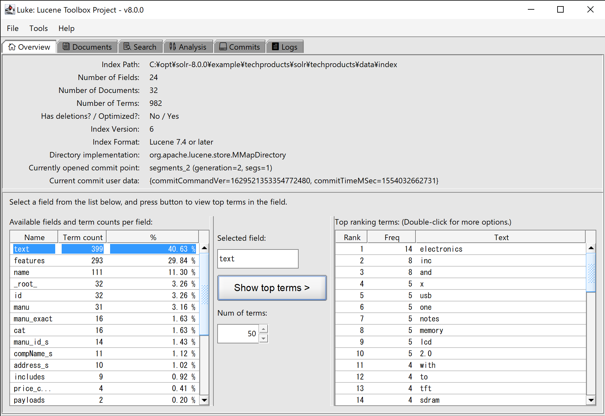

 

IMPORTANT NOTICE
================

Please see:

[Luke become an Apache Lucene module (as of Lucene 8.1)!](https://medium.com/@mocobeta/luke-become-an-apache-lucene-module-as-of-lucene-8-1-7d139c998b2)

For contributors: Now Luke is a part of Apache Lucene, issues should be open in the [Apache Lucene Jira](https://issues.apache.org/jira/projects/LUCENE/summary). 

luke
====

 + Swing 

Luke atop Swing.

Luke is the GUI tool for introspecting your Lucene / Solr / Elasticsearch index. It allows:

* Browsing your documents, indexed terms and posting lists
* Searching in the index
* Performing index maintenance: index health checking, index optimization (take a backup before running this!)
* Testing your custom Lucene analyzer (Tokenizer/CharFilter/TokenFilter)

System Requirements
====

JDK8+ is required. Works fine on JDK11.

Launching luke
====
From source code

1. Clone the repository.
2. Run `mvn install` from the project directory. (Make sure you have Java and Maven installed before doing this)
3. Use [luke.sh](luke.sh) or [luke.bat](luke.bat) for launching luke from the command line based on the OS you are in.

Using a release

[releases](https://github.com/DmitryKey/luke/releases) page contains stable releases of luke. Download the respective release, unpack and run a shell or batch scripts (or directly with java -jar if you prefer it that way).
 
Recent Changes
====
See [CHANGES.txt](CHANGES.txt)

Luke discussion group
====
[Luke google group](https://groups.google.com/forum/#!forum/luke-discuss)

Search engines luke can deal with
====
In no particular order:

* [Apache Lucene](http://lucene.apache.org/). Most certainly luke can open lucene index produced by pure Lucene. Do people make pure Lucene indices these days?
* [Apache Solr](http://lucene.apache.org/solr/). Solr and Lucene share the same code base, so it is natural that luke can open Lucene Index produced by Solr. 
* [Elasticsearch](https://github.com/elastic/elasticsearch). Elasticsearch uses Lucene as its lowest-level search engine base. So luke can open its index too!

Intro video about features
====
This lightning talk was delivered by [Dmitry Kan](https://github.com/DmitryKey) on ApacheCon 2015 in Austin, Texas.

Brief project history
====

* The original author is [Andrzej Bialecki](https://code.google.com/p/luke)
* The project has been mavenized by Neil Ireson (see google group discussion [here](http://bit.ly/16Y8utO))
* The project has been ported to Lucene trunk (marked as 5.0 at the time) by [Dmitry Kan](https://github.com/DmitryKey)
* The project has been back-ported to Lucene 4.3 by sonarname, who later decided not to continue supporting the project
* There are updates to the (non-mavenized) project done by [tarzanek](https://github.com/tarzanek/luke)
* The UI (and core components) has been re-implemented on top of JavaFX / Swing by [Tomoko Uchida](https://github.com/mocobeta).

This project's goal
====

0. Keep the project mavenized (compatible with Apache Lucene and Solr style)
1. To port the thinlet UI to an ASL compliant license framework so that it can be contributed back to Apache Lucene.
   Current work is done with Swing.
2. Maintain a single point of trust for the development and updates of the tool. That said,
   everyone is welcome to join.

Committers
====
* [Dmitry Kan](https://github.com/DmitryKey)
* [Tomoko Uchida](https://github.com/mocobeta)

Documentation
====
The documentation is being written along the way of discovering the luke's usage scenarios.

https://github.com/DmitryKey/luke/wiki

You are free and welcome to contribute you findings!

Feature / bug fix requests
====
Found bug? Missing a useful feature? Raise an issue here:

https://github.com/DmitryKey/luke/issues

Or, and btw, the pull requests are welcome as well!

Releases
====

All of the [releases](https://github.com/DmitryKey/luke/releases) you find under the "releases" link above are versioned after the Lucene's version they use.

Usually we don't do releases for minor version upgrades, because the major release usually can read the index of the next minor release.

An example: lucene 4.8.0 can read the index generated by lucene 4.8.1. Hence luke 4.8.0 can read too.

Conclusion: in order to find a luke release that can read an index of your version of Lucene, pick the closest major version
and download luke for that from the [releases](https://github.com/DmitryKey/luke/releases) page.

Where is (legacy) Thinlet version luke?
====

[luke-thinlet](https://github.com/DmitryKey/luke/blob/luke-thinlet/README.md) branch holds Thinlet version. From version 7.3.1, the main branch is running JavaFX (later, it was switched to Swing) version luke and Thinlet version is not maintained/updated. Please do not create issues or send pull requests to this branch.

Where is luke 4.4.0 ?
===

There is no separate luke 4.4.0 release, but luke 4.5.0 should open the Lucene 4.4.0 index just fine.

Licensing
===

This software is distributed under [ALv2](http://www.apache.org/licenses/LICENSE-2.0.html), and includes [The Elegant Icon Font](https://www.elegantthemes.com/blog/resources/elegant-icon-font) which is licensed under the [MIT](https://opensource.org/licenses/MIT).

Donation
===
If you enjoy using luke you can consider buying us a cup of tea / coffee :)

Credits
===
We would like to express our gratitude to JetBrains for their support of luke with awesome suit of IDEs, in particular: Intellij IDEA.

Thank you! 
